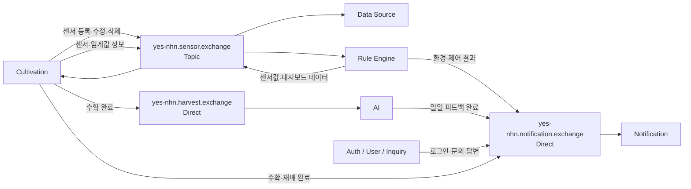
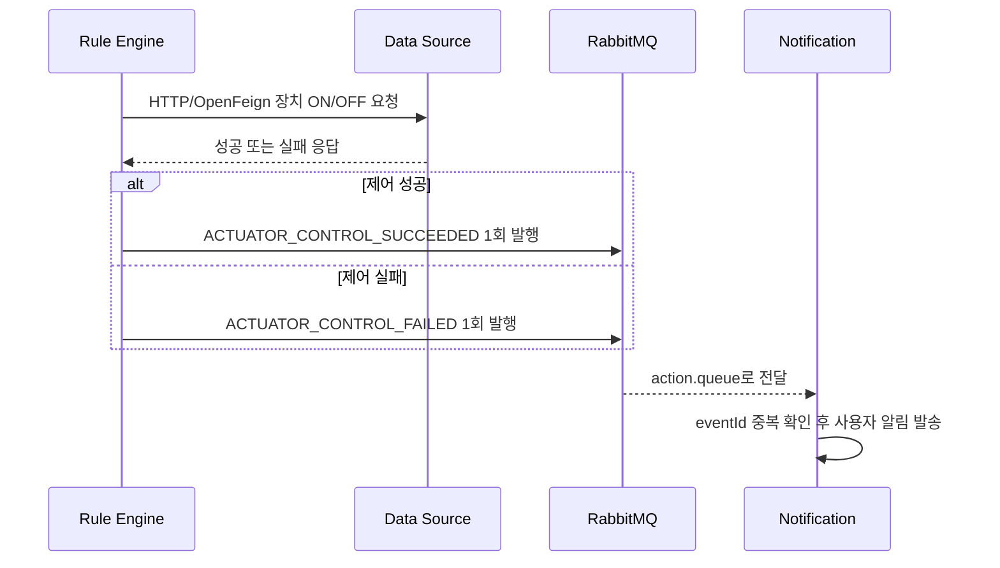

# 2026-08-04 RabbitMQ 연동 회의 정리

## 1. 문서 목적

이 문서는 2026년 8월 4일 진행한 RabbitMQ 연동 회의의 전사문, 칠판 사진, 회의 필기,
추가 확인 답변을 대조해 정리한 최종 회의 기록이다.

다음 내용을 한 곳에서 확인하는 것이 목적이다.

- 서비스 사이에서 어떤 데이터를 동기 또는 비동기로 전달하는가
- 어떤 Exchange와 Queue를 사용하는가
- Exchange 타입은 무엇인가
- Notification Service가 어떤 Queue를 소비하는가
- 재시도와 DLQ를 어떻게 운영하는가
- 아직 확정하지 않은 내용은 무엇인가

Routing Key와 Producer별 최종 JSON payload는 이번 회의에서 확정하지 않았다. 따라서 이
문서에서도 확정 사항과 후속 합의 사항을 분리한다.

---

## 2. 한눈에 보는 최종 결론

### 2.1 Exchange 재사용 원칙

비슷한 업무 영역의 이벤트는 하나의 Exchange를 재사용하고, Consumer와 용도에 따라 Queue를
나눈다.

```text
센서 계열        → yes-nhn.sensor.exchange
알림 계열        → yes-nhn.notification.exchange
수확·AI 계열     → yes-nhn.harvest.exchange
공통 실패 메시지 → yes-nhn.dlx → yes-nhn.dlq
```

### 2.2 Exchange 타입

| Exchange | 타입 | 이유 |
|---|---|---|
| `yes-nhn.sensor.exchange` | Topic | 같은 센서 데이터를 여러 Consumer에게 분류·전달하기 편하도록 사용 |
| `yes-nhn.notification.exchange` | Direct | 알림 용도별 Queue를 정확하게 지정해 전달 |
| `yes-nhn.harvest.exchange` | Direct | Cultivation이 AI의 수확 처리 Queue로 정확하게 전달 |
| `yes-nhn.dlx` | Direct | 실패 메시지를 공용 DLQ로 명확하게 전달 |

이번 프로젝트는 특별히 Topic이 필요한 센서 영역을 제외하면 Direct Exchange를 기본으로
사용한다.

### 2.3 동기·비동기 핵심 결정

```text
센서값·이벤트·알림 전달 → RabbitMQ 비동기
실제 액추에이터 ON/OFF 명령과 결과 응답 → HTTP/OpenFeign 동기
```

Rule Engine이 장치 ON/OFF를 판단하고 Data Source가 실제 가상 액추에이터를 실행한다.
Notification은 장치를 제어하지 않고, Rule Engine이 발행한 성공 또는 실패 결과 이벤트를
받아 사용자에게 한 번 알린다.

### 2.4 DLQ 정책

```text
공용 DLX   : yes-nhn.dlx
공용 DLQ   : yes-nhn.dlq
관리 방식  : RabbitMQ Management UI에서 관리자가 확인 후 수동 처리·삭제
```

Notification Service가 공용 DLQ를 자동 소비하지 않는다. 자동 Consumer가 메시지를 ACK하면
DLQ에서 사라져 관리자가 수동 확인하기 어려워지기 때문이다.

---

## 3. 이름 규칙

회의에서 실제로 사용한 이름을 기준으로 다음처럼 정리한다.

### 3.1 Exchange

```text
yes-nhn.{업무영역}.exchange
```

예시:

```text
yes-nhn.sensor.exchange
yes-nhn.notification.exchange
yes-nhn.harvest.exchange
```

### 3.2 Queue

```text
yes-nhn.{Consumer 또는 서비스}.{용도}.queue
```

예시:

```text
yes-nhn.data-source.sensor-info.queue
yes-nhn.rule-engine.threshold-info.queue
yes-nhn.notification.daily.queue
yes-nhn.ai.harvest.queue
```

`yes-nhn` 접두어는 같은 RabbitMQ Virtual Host를 사용하는 다른 프로젝트와 이름이 충돌하는
것을 방지한다. 공유 RabbitMQ 관리 화면에는 이미 `notification.events`, `telegram.events`,
여러 프로젝트의 `*.dlx`가 존재하므로 `notification.events` 같은 일반 이름을 사용하면 안
된다.

---

## 4. 전체 비동기 흐름



위 그림에서 Cultivation의 수확 완료는 목적에 따라 두 경로로 발행된다.

- AI 처리용: `yes-nhn.harvest.exchange`
- 사용자 알림용: `yes-nhn.notification.exchange`

두 Exchange에 보내는 이벤트의 공통 ID와 payload 정책은 Producer 담당자와 추가로 맞춰야
한다.

---

## 5. Exchange·Queue 최종 목록

### 5.1 Sensor Exchange 재사용 영역

Exchange:

```text
yes-nhn.sensor.exchange
```

타입:

```text
Topic
```

| 번호 | Producer → Consumer | 목적 | Queue |
|---|---|---|---|
| 1 | Cultivation → Data Source | 센서 등록·수정·삭제 정보 전달 | `yes-nhn.data-source.sensor-info.queue` |
| 2 | Rule Engine → Cultivation | 대시보드에 표시할 센서값 전달 | `yes-nhn.sensor.sensor-value.queue` |
| 3-1 | Cultivation → Rule Engine | 기기명·위치·사용 재배 등 센서 정보 전달 | `yes-nhn.rule-engine.sensor-info.queue` |
| 3-2 | Cultivation → Rule Engine | 재배 환경 임계값 전달 | `yes-nhn.rule-engine.threshold-info.queue` |

센서값에는 측정 시각을 포함해야 한다. 대시보드가 메시지를 조금 늦게 받더라도 측정 시각을
기준으로 그래프를 그릴 수 있기 때문이다.

대시보드 센서값은 다음 값이 계속 들어오므로 일부 유실을 허용한다. 이 Queue는 중요한 상태
변경 이벤트와 달리 재시도·DLQ 대상에서 제외하기로 논의했다.

### 5.2 Notification Exchange 재사용 영역

Exchange:

```text
yes-nhn.notification.exchange
```

타입:

```text
Direct
```

| 번호 | Producer | 목적 | Notification 소비 Queue | 관련 이벤트 |
|---|---|---|---|---|
| 4-1 | Rule Engine | 환경 임계값 초과·복구 | `yes-nhn.notification.threshold.queue` | `ENVIRONMENT_THRESHOLD_BREACHED`, `ENVIRONMENT_RECOVERED` |
| 4-2 | Rule Engine | 액추에이터 제어 성공·실패 | `yes-nhn.notification.action.queue` | `ACTUATOR_CONTROL_SUCCEEDED`, `ACTUATOR_CONTROL_FAILED` |
| 5 | AI | 일일 피드백 생성 완료 | `yes-nhn.notification.daily.queue` | `DAILY_FEEDBACK_COMPLETED` |
| 6-1 | Auth/User | 로그인 성공 | `yes-nhn.notification.login.queue` | `LOGIN_SUCCEEDED` |
| 6-2 | Auth/User/Inquiry | 문의 등록 후 관리자 알림 | `yes-nhn.notification.question.queue` | 이벤트 코드·관리자 대상 선정 방식 추가 합의 필요 |
| 6-3 | Auth/User/Inquiry | 문의 답변 후 작성자 알림 | `yes-nhn.notification.answer.queue` | `INQUIRY_ANSWERED` |
| 7-1 | Cultivation | 수확 완료 사용자 알림 | `yes-nhn.notification.harvest.queue` | `HARVEST_COMPLETED` |
| 7-2 | Cultivation | 재배 종료 사용자 알림 | `yes-nhn.notification.cultivation-finished.queue` | `CULTIVATION_FINISHED` |

Producer가 Queue에서 메시지를 꺼내는 것이 아니다. Producer는 Direct Exchange에 이벤트와
Routing Key를 발행한다. Notification이 Queue들을 Exchange에 Binding하고 각 Queue에서
메시지를 소비한다.

### 5.3 Harvest Exchange

| Producer → Consumer | Exchange | 타입 | Queue | 목적 |
|---|---|---|---|---|
| Cultivation → AI | `yes-nhn.harvest.exchange` | Direct | `yes-nhn.ai.harvest.queue` | 수확 완료 정보를 AI에 전달 |

필기에는 `yes-nhn.harvest queue`라고 적힌 부분이 있으나 칠판과 이름 규칙을 기준으로
`yes-nhn.ai.harvest.queue`가 정확한 이름이다.

---

## 6. 액추에이터 제어 흐름

### 6.1 책임

- Rule Engine: 센서값과 임계값을 보고 ON/OFF 판단
- Data Source: 가상 액추에이터 ON/OFF 실행
- Notification: 결과 이벤트를 받아 Telegram·Discord로 사용자에게 알림

### 6.2 처리 순서



장치를 켜는 요청과 끄는 요청은 각각 하나의 동기 요청이다. Rule Engine은 이후 센서값이 정상
범위에 들어오면 OFF 요청을 다시 보낸다.

같은 제어 결과를 재발행해야 한다면 새로운 `eventId`를 만들지 않고 기존 ID를 유지해야 한다.
Notification의 `source_event_id UNIQUE` 제약이 같은 이벤트의 중복 알림을 막는다.

### 6.3 추가로 필요한 안전 정책

회의에서 과도한 작동과 환경값 오버슈트 위험이 언급됐다. 다음 값은 Rule/Data Source 담당자가
추가로 정해야 한다.

- 최대 연속 작동 시간
- ON 이후 재판단까지의 Cooldown
- 정상 범위 진입 시 OFF 조건
- 응답 지연 또는 타임아웃 시 실패 판정 기준
- 중복 ON/OFF 요청 처리 기준

---

## 7. DLX·DLQ와 재시도

### 7.1 확정 이름

```text
Dead Letter Exchange: yes-nhn.dlx
Dead Letter Queue:    yes-nhn.dlq
```

둘 다 Durable로 선언하고 DLX는 Direct Exchange를 사용한다.

### 7.2 처리 원칙

```text
중요 이벤트 처리 실패
  → 재시도
  → 최종 실패
  → yes-nhn.dlx
  → yes-nhn.dlq
  → 관리자가 Management UI에서 확인
  → 원인 조치 후 수동 삭제 또는 재처리
```

회의에서는 중요한 이벤트는 최대 3회 시도하는 방향으로 논의했다. 대시보드 센서값처럼 다음
측정값으로 대체 가능한 데이터는 재시도와 DLQ를 사용하지 않는다.

주의할 점은 발송 Provider 재시도와 RabbitMQ Consumer 재시도가 서로 다른 단계라는 것이다.

- Provider 재시도: Telegram·Discord 전송 실패를 최대 3회 시도
- Consumer 재시도: RabbitMQ 이벤트 처리 중 일시적인 DB·시스템 오류를 다시 시도

현재 Notification 코드의 Provider 발송 3회 재시도는 구현되어 있다. RabbitMQ Consumer의
오류 종류별 재시도 여부와 ACK/NACK 세부 방식은 후속 구현·검증이 필요하다.

### 7.3 자동 DLQ Consumer를 두지 않는 이유

Notification이 `yes-nhn.dlq`를 자동 소비하고 ACK하면 메시지가 Queue에서 제거된다. 이번
프로젝트에서는 관리자가 실패 원문과 Header를 확인할 수 있도록 자동 Consumer를 두지 않고
수동 운영한다.

민감한 토큰·비밀번호·Webhook URL은 DLQ payload에도 넣지 않는다.

---

## 8. RabbitMQ Management UI 확인 방법

회의에서 확인한 공유 RabbitMQ 관리 화면에는 NHN 과정에서 사용하는 여러 프로젝트의
Exchange가 표시됐다.

### 8.1 확인할 항목

| 화면 항목 | 의미 |
|---|---|
| Virtual host | Exchange·Queue 이름 공간과 권한을 분리하는 단위 |
| Name | Exchange 이름 |
| Type | direct, topic, fanout, headers 중 하나 |
| `D` | Durable. RabbitMQ 재시작 후에도 정의 유지 |
| Message rate in | Exchange로 들어오는 메시지 속도 |
| Message rate out | Exchange에서 Queue로 전달되는 메시지 속도 |

### 8.2 로컬 확인 순서

1. 로컬 RabbitMQ 실행
2. Notification Service 실행
3. Management UI의 Exchanges 탭 확인
4. `yes-nhn.notification.exchange`가 Direct인지 확인
5. Queues 탭에서 Notification Queue 8개 확인
6. 각 Queue의 Bindings에서 Exchange와 Routing Key 확인
7. 테스트 이벤트 발행
8. Message rate와 Queue의 Ready/Unacked 수 확인

공유 NHN RabbitMQ 화면은 참고용이고, 이번 프로젝트 연동은 우선 로컬 환경에서 검증한다.

---

## 9. Routing Key 상태

Routing Key는 이번 회의에서 구체적인 문자열을 확정하지 않았다.

현재 Notification `application.yml`은 로컬에서 Direct Binding을 만들 수 있도록 Queue명과
동일한 값을 기본 Routing Key로 사용한다.

예시:

```text
Queue:       yes-nhn.notification.action.queue
기본 Key:    yes-nhn.notification.action.queue
```

이 값은 로컬 기본값일 뿐 Producer와의 최종 계약이 아니다. Routing Key 회의가 끝나면
환경변수와 Producer 발행 코드를 같은 값으로 교체해야 한다.

---

## 10. 현재 Notification 코드 반영 내용

이번 회의 후 다음 내용을 반영했다.

- Notification Exchange를 `yes-nhn.notification.exchange`로 변경
- Notification Exchange 타입을 Topic에서 Direct로 변경
- 단일 Queue Consumer를 용도별 8개 Queue Consumer로 변경
- 공용 DLX/DLQ 기본값을 `yes-nhn.dlx`, `yes-nhn.dlq`로 변경
- 공용 DLQ 자동 Consumer는 만들지 않음
- `ACTUATOR_CONTROL_SUCCEEDED` 기준 Seed와 Telegram·Discord 템플릿 추가
- 수확 완료와 재배 종료용 Notification Queue 추가
- Routing Key는 Queue명과 같은 로컬 기본값만 제공하고 최종 미확정 상태로 명시

이미 적용된 V2 Seed는 수정하지 않고 V8 Migration으로 제어 성공 이벤트를 추가한다.

---

## 11. 코드와 회의 결정의 남은 차이

### 11.1 문의 등록 관리자 알림

`yes-nhn.notification.question.queue`는 확정됐지만 현재 Seed에는 문의 답변 이벤트인
`INQUIRY_ANSWERED`만 존재한다.

문의 등록 알림을 실제 구현하려면 다음을 정해야 한다.

- 이벤트 코드: 예) `INQUIRY_CREATED`
- `targetType`과 `targetId` 의미
- 어떤 사용자를 관리자로 판단하는가
- 관리자가 구독 API로 직접 구독하는가
- 모든 관리자에게 보내는가, 담당 관리자 한 명에게 보내는가

현재 구독 모델은 사용자가 특정 `targetId`를 구독하는 구조다. 새 문의가 만들어진 이후
관리자가 그 문의 ID를 미리 구독할 수 없으므로 관리자 전체 알림은 별도의 대상 선정 로직이
필요하다.

### 11.2 RabbitMQ Consumer 재시도

공통 최대 3회 정책은 논의됐지만 계약 오류, 기준정보 오류, 일시적인 DB 오류를 모두 똑같이
재시도하면 비효율적이다. 다음 분류가 필요하다.

- 잘못된 JSON·필수값 누락: 즉시 DLQ
- 등록되지 않은 이벤트·템플릿: 즉시 DLQ 또는 운영 설정 수정 후 재처리
- 일시적인 DB·네트워크 오류: 제한 재시도 후 DLQ
- 중복 `eventId`: 정상 중복으로 종료, DLQ 금지

### 11.3 Producer별 payload

Exchange와 Queue는 정했지만 템플릿 변수 이름은 Producer와 맞춰야 한다.

예시:

```text
Rule:        cultivationName, deviceName, controlType, controlledAt
AI:          cultivationName, feedbackId, feedbackSummary, feedbackDate
Auth:        provider, loginAt
Inquiry:     inquiryId, inquiryTitle, answeredAt
Cultivation: harvestAmount, unit, harvestedAt, finishedAt
```

---

## 12. 담당자별 후속 작업

### Rule Engine 담당자

- `ACTUATOR_CONTROL_SUCCEEDED`와 `ACTUATOR_CONTROL_FAILED` 발행 시점 확정
- 같은 제어 결과를 한 번만 발행
- 성공·실패 payload와 `eventId` 유지 규칙 공유
- 환경 임계값 초과·복구 payload 공유
- Data Source 동기 제어 API와 Timeout 정책 확정

### Cultivation 담당자

- 센서 등록·수정·삭제 이벤트 구분 방식 공유
- Rule Engine에 보낼 sensor-info·threshold-info payload 공유
- `HARVEST_COMPLETED`, `CULTIVATION_FINISHED`를 Notification Exchange에도 발행
- AI용 Harvest Exchange 이벤트와 Notification 이벤트의 ID·payload 관계 확정

### AI 담당자

- `yes-nhn.ai.harvest.queue` 소비 설정
- `DAILY_FEEDBACK_COMPLETED` 발행 시점과 payload 확정
- 같은 재배·날짜에 완료 이벤트를 한 번만 발행하는 방법 합의

### Auth/User/Inquiry 담당자

- 로그인·문의 등록·문의 답변 이벤트를 Notification Exchange에 발행
- 문의 등록 시 관리자 대상 선정 방식 합의
- 문의 답변은 실제 문의 작성자가 받을 수 있도록 userId 또는 권한 확인 방법 제공

### Notification 담당자

- Direct Exchange와 Queue 8개 로컬 생성 확인
- 이벤트별 Routing Key 확정 후 환경변수 반영
- 제어 성공 Seed·템플릿 Migration 검증
- Queue별 Mock 이벤트 통합 테스트 작성
- Consumer 오류 분류별 ACK/NACK·재시도 정책 구현
- 공용 DLQ Management UI 수동 운영 절차 검증

---

## 13. 오타·중복 교정 기록

회의 필기의 다음 표현은 최종 문서에서 교정했다.

| 필기 | 최종 표기 |
|---|---|
| 중복된 5번 AI 항목 | 한 항목으로 통합 |
| `yes-nhn.notificatipn.login.queue` | `yes-nhn.notification.login.queue` |
| `yes-nhn.harvest queue` | `yes-nhn.ai.harvest.queue` |
| 중복 표기된 Data Source Queue | `yes-nhn.data-source.sensor-info.queue` |
| Auth가 Queue를 Binding | Notification이 Queue를 Binding하고 Auth가 Exchange에 발행 |

---

## 14. 완료 기준

다음 항목을 모두 확인하면 RabbitMQ 이름·토폴로지 연동이 완료된 것으로 본다.

- [x] Exchange 이름 결정
- [x] Queue 이름 결정
- [x] Exchange 타입 결정
- [x] 제어 성공·실패 모두 알림 정책 결정
- [x] 수확·재배 완료도 Notification이 수신하도록 결정
- [x] 공용 DLX/DLQ 이름과 수동 운영 정책 결정
- [ ] Routing Key 문자열 확정
- [ ] Producer별 최종 JSON payload 확정
- [ ] 문의 등록 관리자 대상 선정 방식 확정
- [ ] Consumer ACK/NACK·재시도 세부 구현 확정
- [ ] 로컬 RabbitMQ에서 전체 Exchange·Queue·Binding 확인
- [ ] Producer별 실제 이벤트 통합 테스트 완료

---

## 15. 2026-08-04 구현 검증 결과

회의 확정안을 코드에 반영한 뒤 다음 검증을 수행했다.

| 검증 항목 | 결과 |
|---|---|
| 전체 단위 테스트 `mvn test` | 42개 중 실패 0, 오류 0, DB 통합 테스트 3개는 실행 플래그가 없어 제외 |
| RabbitMQ 구성 전용 테스트 | Direct Exchange, 이벤트 Queue 8개, Binding 8개 확인 |
| 빈 PostgreSQL Migration 통합 테스트 | V1부터 V8까지 정상 적용, 실패 0 |
| 제어 성공 기준정보 | `ACTUATOR_CONTROL_SUCCEEDED` 이벤트 유형과 Telegram·Discord 템플릿 2개 확인 |
| Git diff 형식 검사 | 공백 오류 없음 |

단위 테스트 실행 중 출력되는 실패 로그는 실패 처리 경로를 의도적으로 검증하는 테스트 로그이며,
테스트 실패가 아니다. 실제 RabbitMQ 서버에서 Exchange·Queue·Binding이 생성되는지는 아직 확인하지
않았으므로 완료 기준에서 해당 항목은 미완료로 유지한다.
